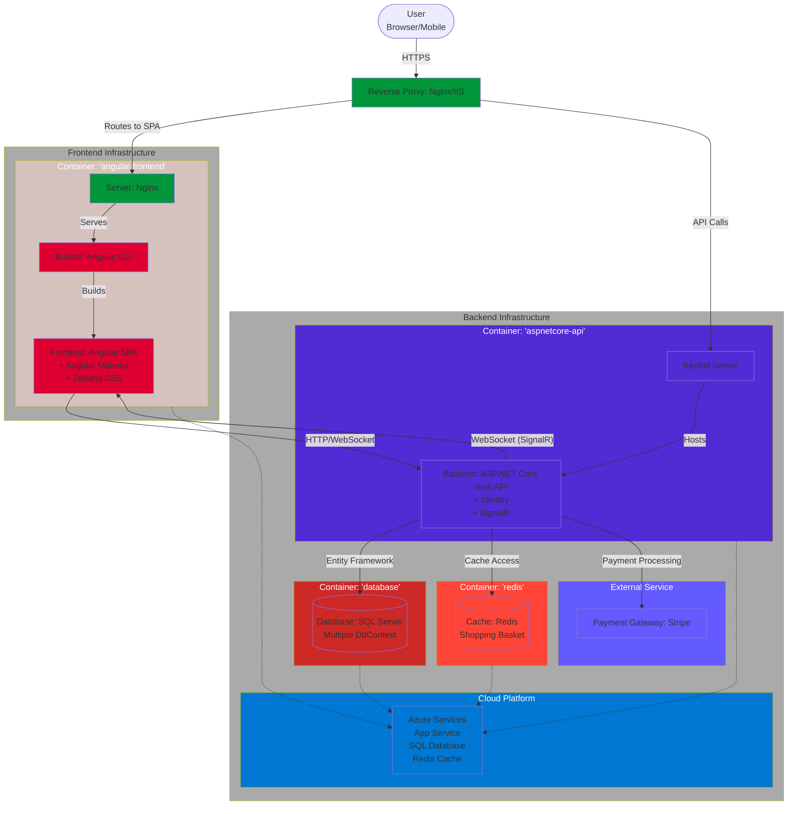

<div align="center" style="margin-top: 30px;">
  
  <h1>Lucina - Korean Skincare E-commerce</h1>
</div>

---

## Overview

**Lucina** is a modern e-commerce platform focused on delivering high-quality Korean skincare products to the Italian market. Built with **Angular**, **.NET Core** and **Stripe**, the project offers a full-stack implementation of an online store with an optimized shopping experience, clean architecture and enterprise-level scalability.

---

## Table of Contents
- [Overview](#overview)
- [Features](#features)
- [Architecture](#architecture)
- [API Documentation](#api-documentation)
- [Live Deployment](#live-deployment)
- [Quickstart](#quickstart)
  - [Requirements](#requirements)
  - [Development Workflow](#development-workflow)
    - [Clone the repository](#clone-the-repository)
    - [Build and launch all containers](#build-and-launch-all-containers)
    - [(Optional) Reset dev environment](#optional-reset-dev-environment)
- [Development Guide](#development-guide)
  - [Backend (ASP.NET Core)](#backend-aspnet-core)
    - [Configuration](#configuration)
    - [Dependencies](#dependencies)
    - [Entity Framework Migrations](#entity-framework-migrations)
    - [Admin User Setup](#admin-user-setup)
    - [Run tests](#run-tests)
    - [Database Schema](#database-schema)
  - [Frontend (Angular + Angular Material)](#frontend-angular--angular-material)
    - [Dependencies](#dependencies-1)
    - [Run tests](#run-tests-1)
    - [Build for production](#build-for-production)
- [Production Workflow](#production-workflow)
  - [Azure Deployment](#azure-deployment)
    - [CI/CD Workflow Overview](#cicd-workflow-overview)
---

## Features

- Complete e-commerce workflow (browsing, basket, checkout)
- Secure login and registration using ASP.NET Identity
- Stripe integration with EU-compliant 3D Secure payments
- Basket persistence with Redis
- Product filtering, sorting, searching, and pagination
- Order creation and payment flow
- Mobile-first responsive UI with Angular Material & Tailwind CSS
- Clean architecture with Repository & Unit of Work patterns
- Admin-ready backend with role-based access
- Blog, reviews and content-ready structure
- Cloud-deployable to Microsoft Azure

---

## Architecture


---

## Tech Stack

| Layer         | Technology                     |
|---------------|--------------------------------|
| Frontend      | Angular, Angular Material, Tailwind CSS |
| Backend       | ASP.NET Core, Entity Framework Core |
| Authentication| ASP.NET Identity, Role-based auth |
| Database      | SQL Server + Redis             |
| Payments      | Stripe                         |
| Hosting       | Azure                          |
| Realtime      | SignalR (optional integration) |

---

## Architecture Overview

- Modular architecture with **lazy-loaded Angular modules**
- Separation of concerns via **Repository**, **Unit of Work** and **Specification Pattern**
- Use of **multiple DbContext boundaries** for clear responsibility
- Built-in **admin panel** features (e.g., manage products, roles)
- Optional integrations: ERP systems, email marketing tools

---

### Requirements

- **.NET 8.0 SDK**
- **Node.js 18+** and **npm**
- **Docker** and **Docker Compose**
- **SQL Server** (or SQL Server LocalDB for development)
- **Redis** (for basket persistence)

### Development Workflow

#### Clone the repository

```bash
git clone https://github.com/yourusername/lucina-ecommerce.git
cd lucina-ecommerce
```

#### Environment Configuration

Before running the application, configure the necessary environment variables and settings for both backend and frontend.

##### Backend Configuration (`appsettings.Development.json`)

Create `appsettings.Development.json` in the `API` project root:

```json
{
  "Logging": {
    "LogLevel": {
      "Default": "Information",
      "Microsoft.AspNetCore": "Information"
    }
  },
  "ConnectionStrings": {
    "DefaultConnection": "Server=<yourServer>,1433;Database=<yourDatabase>;User Id=<yourId>;Password=<yourPassword>;TrustServerCertificate=True"
  },
  "StripeSettings": {
    "PublishableKey": "<your-publishable-key>",
    "SecretKey": "<your-secret-key>"
  }
}
```

Replace placeholders with your actual credentials.

##### Frontend Configuration (`environment.ts`)

Configure `client/src/environments/environment.ts`:

```typescript
export const environment = {
  production: false,
  apiUrl: 'https://localhost:5001/api/',
  stripePublicKey: '<your-publishable-key>'
};
```

#### Set up the backend

```bash
cd API
dotnet restore
dotnet ef database update
dotnet run
```

The API will be available at `https://localhost:5001`

#### Set up the frontend

```bash
cd client
npm install
ng serve
```

The Angular app will be available at `http://localhost:4200`

#### Set up Redis

For basket persistence, you need Redis running. You can use Docker:

```bash
docker run --name redis -p 6379:6379 -d redis:alpine
```

Or for SQL Server in Docker (development):

```bash
docker run -e "ACCEPT_EULA=Y" -e "SA_PASSWORD=<yourPassword>" -p 1433:1433 --name sqlserver -d mcr.microsoft.com/mssql/server
```

#### Build and launch all containers

```bash
# Build and start all services
docker-compose up --build

# Or run in detached mode
docker-compose up -d --build
```

The application will be available at:
- **Frontend**: http://localhost:4200
- **Backend API**: https://localhost:5001
- **Swagger UI**: https://localhost:5001/swagger

#### (Optional) Reset dev environment

```bash
# Stop all containers and remove volumes
docker-compose down -v

# Remove all images
docker-compose down --rmi all

# Clean rebuild
docker-compose up --build --force-recreate
```

### Important Notes

- The backend runs on port **5001** by default (HTTPS). Make sure it's not blocked by firewall or antivirus software.
- **Redis** must be running for shopping cart persistence.
- For development with **SQL Server in Docker**, remember to expose port **1433** and accept TCP connections.

## Development Guide

### Backend (ASP.NET Core)

#### Configuration

Configuration is managed through `appsettings.json` and environment variables:

```bash
# Navigate to API project
cd src/API

# Copy example configuration
cp appsettings.example.json appsettings.Development.json
```

Key configuration sections:
- **ConnectionStrings**: Database and Redis connections
- **Stripe**: Payment gateway settings
- **Identity**: Authentication configuration
- **Cors**: Cross-origin request settings

#### Dependencies

```bash
# Restore NuGet packages
dotnet restore

# Add new package example
dotnet add package PackageName
```

#### Entity Framework Migrations

```bash
# Create new migration
dotnet ef migrations add MigrationName -p Infrastructure -s API

# Update database
dotnet ef database update -p Infrastructure -s API

# Drop database (development only)
dotnet ef database drop -p Infrastructure -s API
```

#### Admin User Setup

```bash
# Run the application and navigate to
# https://localhost:5001/api/account/seed-admin
# This will create default admin user (development only)
```

#### Run tests

```bash
# Run all tests
dotnet test

# Run tests with coverage
dotnet test --collect:"XPlat Code Coverage"

# Run specific test project
dotnet test tests/UnitTests
```

#### Database Schema

Generate database schema documentation:

```bash
# Using Entity Framework Power Tools or
# dotnet ef dbcontext scaffold for reverse engineering
```

### Frontend (Angular + Angular Material)

#### Dependencies

```bash
# Navigate to client app
cd client

# Install dependencies
npm install

# Add new dependency
npm install package-name
```

#### Run tests

```bash
# Run unit tests
ng test

# Run unit tests with coverage
ng test --code-coverage

# Run e2e tests
ng e2e

# Lint code
ng lint
```

#### Build for production

```bash
# Build for production
ng build --configuration production

# Analyze bundle size
ng build --stats-json
npx webpack-bundle-analyzer dist/stats.json
```

## Production Workflow

### Azure Deployment

The application is deployed to Microsoft Azure using the following services:

- **Azure App Service**: Hosts the ASP.NET Core API
- **Azure Static Web Apps**: Hosts the Angular frontend
- **Azure SQL Database**: Production database
- **Azure Cache for Redis**: Caching layer
- **Azure Application Gateway**: Load balancing and SSL termination

#### CI/CD Workflow Overview

1. **Source Control**: Git push triggers pipeline
2. **Build Stage**: 
   - Build ASP.NET Core API
   - Build Angular application
   - Run unit tests
3. **Package Stage**: Create deployment artifacts
4. **Deploy Stage**:
   - Deploy API to Azure App Service
   - Deploy frontend to Azure Static Web Apps
   - Run database migrations
5. **Post-Deployment**: Run integration tests

```bash
# Deploy using Azure CLI
az webapp deployment source config-zip \
  --resource-group myResourceGroup \
  --name myAppName \
  --src deployment.zip
```

For detailed deployment instructions, see the [deployment guide](docs/DEPLOYMENT.md).
