# Software Design Document

## Table of Contents

1. [Introduction](#1-introduction)
2. [Actors](#2-actors)
3. [Use Case Diagram — Full System](#3-use-case-diagram--full-system)
4. [Use Case Diagrams — By Subsystem](#4-use-case-diagrams--by-subsystem)
   - 4.1 [Catalogue & Search](#41-catalogue--search)
   - 4.2 [Cart & Checkout](#42-cart--checkout)
   - 4.3 [User Account](#43-user-account)
   - 4.4 [Coupon System](#44-coupon-system)
   - 4.5 [AI Assistant & Content](#45-ai-assistant--content)
   - 4.6 [Admin Back-Office](#46-admin-back-office)
5. [Architecture Overview](#5-architecture-overview)
6. [Component Diagram](#6-component-diagram)
7. [Domain Class Diagram](#7-domain-class-diagram)
8. [Data Model](#8-data-model)
9. [Sequence Diagrams](#9-sequence-diagrams)
   - 9.1 [Register Account](#91-register-account)
   - 9.2 [Login](#92-login)
   - 9.3 [Add Product to Cart](#93-add-product-to-cart)
   - 9.4 [Checkout and Order Confirmation](#94-checkout-and-order-confirmation)
   - 9.5 [Coupon Validation](#95-coupon-validation)
   - 9.6 [AI Assistant Message](#96-ai-assistant-message)
   - 9.7 [Newsletter Subscription](#97-newsletter-subscription)
10. [Activity Diagrams](#10-activity-diagrams)
    - 10.1 [Register Account](#101-register-account)
    - 10.2 [Login](#102-login)
    - 10.3 [Add Product to Cart](#103-add-product-to-cart)
    - 10.4 [Checkout and Order Confirmation](#104-checkout-and-order-confirmation)
    - 10.5 [Coupon Validation](#105-coupon-validation)
11. [Order State Machine](#11-order-state-machine)
12. [Related Documents](#12-related-documents)

---

## 1. Introduction

This Software Design Document describes the structural and behavioural design of the Lucina platform. It covers actor model, use cases, architecture, component breakdown, domain classes, data model, sequence diagrams, activity diagrams and the order state machine.
---

## 2. Actors

The system recognises three primary actors and two secondary actors.

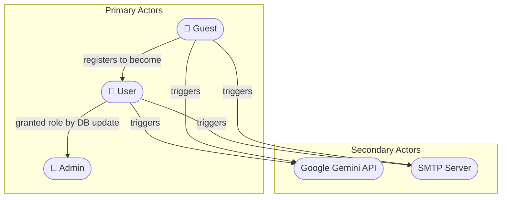
```mermaid
flowchart TD
    subgraph Primary Actors
        G(["👤 Guest"])
        U(["👤 User"])
        A(["👤 Admin"])
    end

    subgraph Secondary Actors
        GEMINI(["Google Gemini API"])
        SMTP(["SMTP Server"])
    end

    G -->|"registers to become"| U
    U -->|"granted role by DB update"| A

    U -->|"triggers"| GEMINI
    G -->|"triggers"| GEMINI
    U -->|"triggers"| SMTP
    G -->|"triggers"| SMTP
```

### Actor Descriptions

| Actor | Type | Description |
|---|---|---|
| **Guest** | Primary | Unauthenticated visitor. Can browse, search, use the AI assistant, subscribe to the newsletter and register. |
| **User** | Primary | Authenticated customer. Inherits all Guest capabilities plus cart management, checkout and order history. |
| **Admin** | Primary | Authenticated operator with elevated privileges. Manages coupons and monitors orders. Created via direct DB assignment. |
| **Google Gemini API** | Secondary | External AI service invoked by the chatbot subsystem to generate Italian-language K-Beauty responses. |
| **SMTP Server** | Secondary | External mail relay invoked for welcome emails, contact form delivery and order confirmation. In development, intercepted by smtp4dev. |

---

## 3. Use Case Diagram — Full System

High-level overview of all actors and their primary interactions with the system.

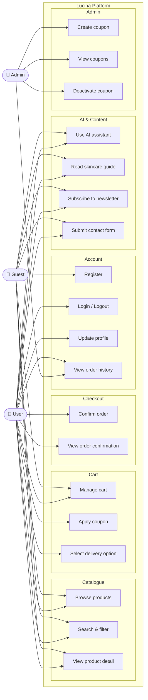
```mermaid
flowchart LR
    G(["👤 Guest"])
    U(["👤 User"])
    A(["👤 Admin"])

    subgraph Lucina Platform
        subgraph Catalogue
            UC1["Browse products"]
            UC2["Search & filter"]
            UC3["View product detail"]
        end

        subgraph Cart
            UC4["Manage cart"]
            UC5["Apply coupon"]
            UC6["Select delivery option"]
        end

        subgraph Checkout
            UC7["Confirm order"]
            UC8["View order confirmation"]
        end

        subgraph Account
            UC9["Register"]
            UC10["Login / Logout"]
            UC11["Update profile"]
            UC12["View order history"]
        end

        subgraph AI & Content
            UC13["Use AI assistant"]
            UC14["Read skincare guide"]
            UC15["Subscribe to newsletter"]
            UC16["Submit contact form"]
        end

        subgraph Admin
            UC17["Create coupon"]
            UC18["View coupons"]
            UC19["Deactivate coupon"]
        end
    end

    G --> UC1
    G --> UC2
    G --> UC3
    G --> UC4
    G --> UC9
    G --> UC13
    G --> UC14
    G --> UC15
    G --> UC16

    U --> UC1
    U --> UC2
    U --> UC3
    U --> UC4
    U --> UC5
    U --> UC6
    U --> UC7
    U --> UC8
    U --> UC10
    U --> UC11
    U --> UC12
    U --> UC13
    U --> UC14
    U --> UC15
    U --> UC16

    A --> UC17
    A --> UC18
    A --> UC19
    A --> UC12
```

---

## 4. Use Case Diagrams — By Subsystem

### 4.1 Catalogue & Search

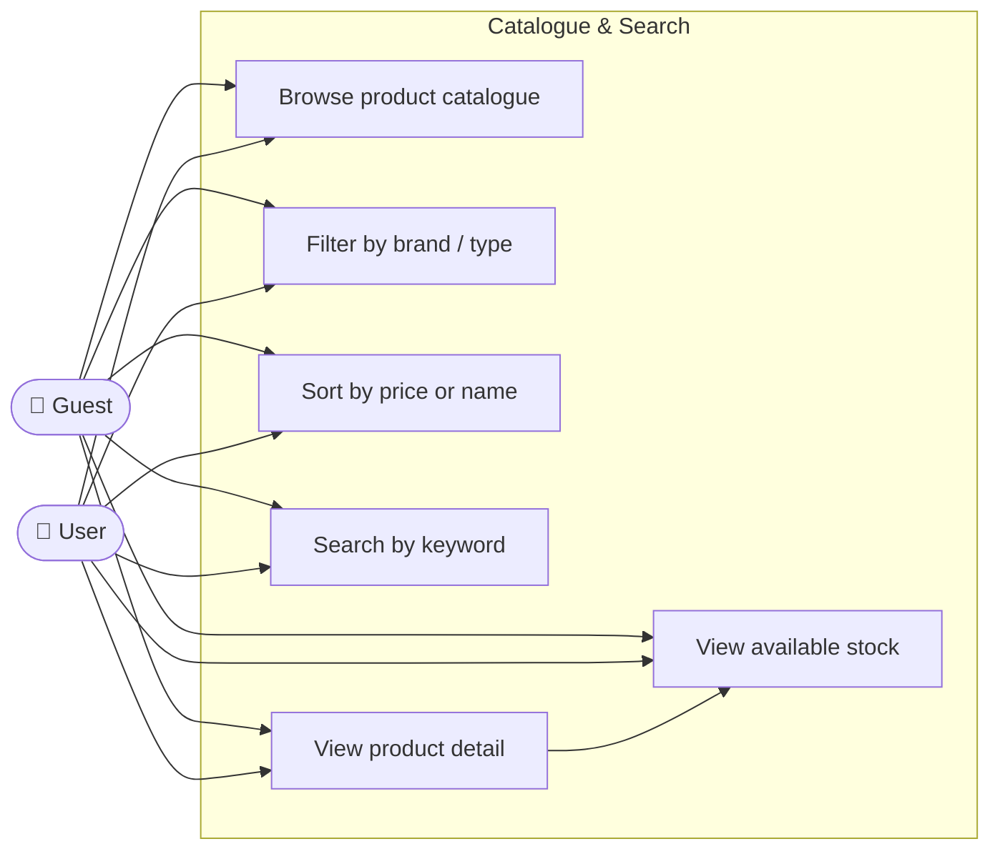
```mermaid
flowchart LR
    G(["👤 Guest"])
    U(["👤 User"])

    subgraph Catalogue & Search
        UC1["Browse product catalogue"]
        UC2["Filter by brand / type"]
        UC3["Sort by price or name"]
        UC4["Search by keyword"]
        UC5["View product detail"]
        UC6["View available stock"]
    end

    G --> UC1
    G --> UC2
    G --> UC3
    G --> UC4
    G --> UC5
    G --> UC6

    U --> UC1
    U --> UC2
    U --> UC3
    U --> UC4
    U --> UC5
    U --> UC6

    UC5 --> UC6
```

### 4.2 Cart & Checkout

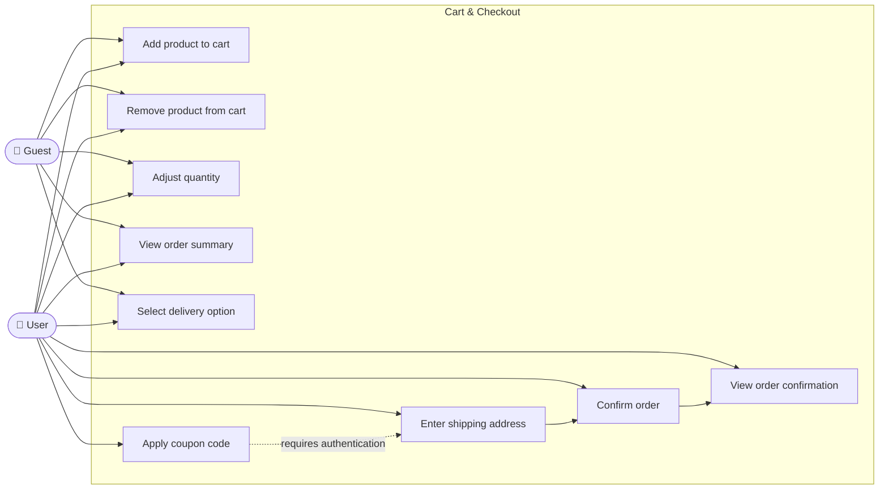
```mermaid
flowchart LR
    G(["👤 Guest"])
    U(["👤 User"])

    subgraph Cart & Checkout
        UC1["Add product to cart"]
        UC2["Remove product from cart"]
        UC3["Adjust quantity"]
        UC4["View order summary"]
        UC5["Select delivery option"]
        UC6["Apply coupon code"]
        UC7["Enter shipping address"]
        UC8["Confirm order"]
        UC9["View order confirmation"]
    end

    G --> UC1
    G --> UC2
    G --> UC3
    G --> UC4
    G --> UC5

    U --> UC1
    U --> UC2
    U --> UC3
    U --> UC4
    U --> UC5
    U --> UC6
    U --> UC7
    U --> UC8
    U --> UC9

    UC6 -.->|"requires authentication"| UC7
    UC7 --> UC8
    UC8 --> UC9
```

### 4.3 User Account

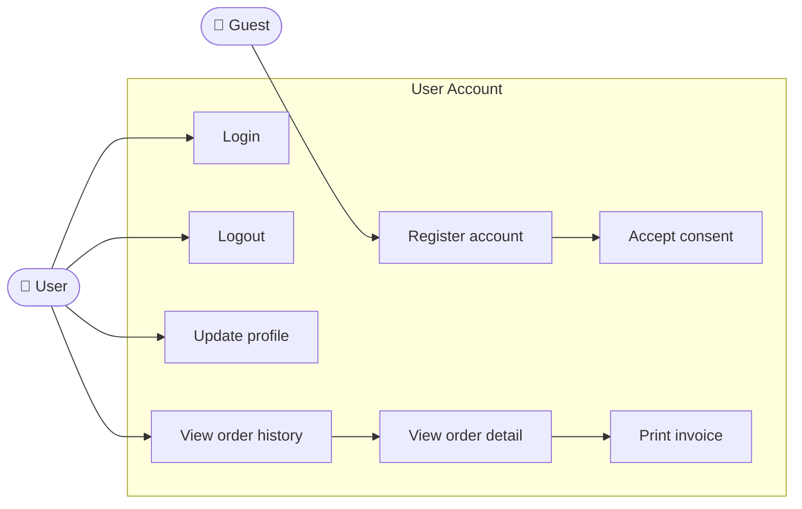
```mermaid
flowchart LR
    G(["👤 Guest"])
    U(["👤 User"])

    subgraph User Account
        UC1["Register account"]
        UC2["Accept consent"]
        UC3["Login"]
        UC4["Logout"]
        UC5["Update profile"]
        UC6["View order history"]
        UC7["View order detail"]
        UC8["Print invoice"]
    end

    G --> UC1
    UC1 --> UC2

    U --> UC3
    U --> UC4
    U --> UC5
    U --> UC6
    UC6 --> UC7
    UC7 --> UC8
```

### 4.4 Coupon System

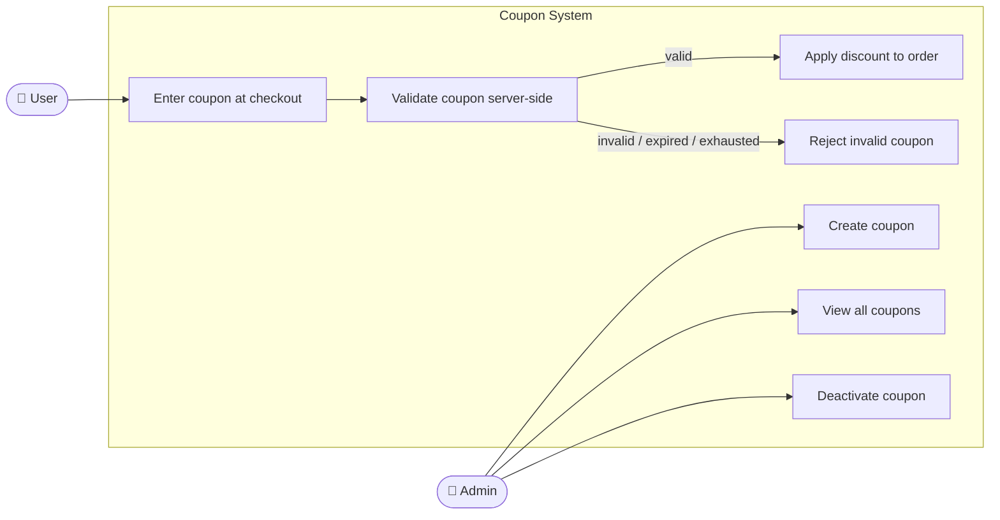
```mermaid
flowchart LR
    U(["👤 User"])
    A(["👤 Admin"])

    subgraph Coupon System
        UC1["Enter coupon at checkout"]
        UC2["Validate coupon server-side"]
        UC3["Apply discount to order"]
        UC4["Reject invalid coupon"]
        UC5["Create coupon"]
        UC6["View all coupons"]
        UC7["Deactivate coupon"]
    end

    U --> UC1
    UC1 --> UC2
    UC2 -->|"valid"| UC3
    UC2 -->|"invalid / expired / exhausted"| UC4

    A --> UC5
    A --> UC6
    A --> UC7
```

### 4.5 AI Assistant & Content

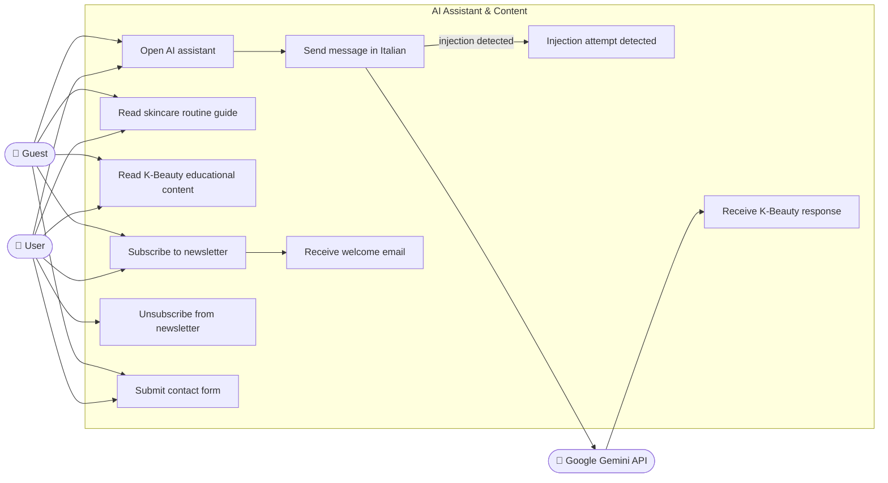
```mermaid
flowchart LR
    G(["👤 Guest"])
    U(["👤 User"])
    GEMINI(["🤖 Google Gemini API"])

    subgraph AI Assistant & Content
        UC1["Open AI assistant"]
        UC2["Send message in Italian"]
        UC3["Receive K-Beauty response"]
        UC4["Injection attempt detected"]
        UC5["Read skincare routine guide"]
        UC6["Read K-Beauty educational content"]
        UC7["Subscribe to newsletter"]
        UC8["Receive welcome email"]
        UC9["Unsubscribe from newsletter"]
        UC10["Submit contact form"]
    end

    G --> UC1
    U --> UC1
    UC1 --> UC2
    UC2 --> GEMINI
    GEMINI --> UC3
    UC2 -->|"injection detected"| UC4

    G --> UC5
    G --> UC6
    U --> UC5
    U --> UC6

    G --> UC7
    U --> UC7
    UC7 --> UC8

    U --> UC9
    G --> UC10
    U --> UC10
```

### 4.6 Admin Back-Office

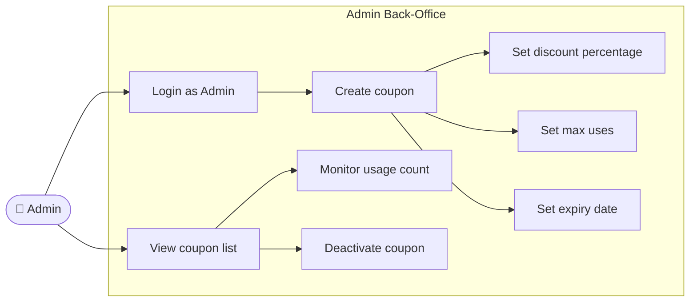
```mermaid
flowchart LR
    A(["👤 Admin"])

    subgraph Admin Back-Office
        UC1["Login as Admin"]
        UC2["Create coupon"]
        UC3["Set discount percentage"]
        UC4["Set max uses"]
        UC5["Set expiry date"]
        UC6["View coupon list"]
        UC7["Monitor usage count"]
        UC8["Deactivate coupon"]
    end

    A --> UC1
    UC1 --> UC2
    UC2 --> UC3
    UC2 --> UC4
    UC2 --> UC5

    A --> UC6
    UC6 --> UC7
    UC6 --> UC8
```

---

## 5. Architecture Overview

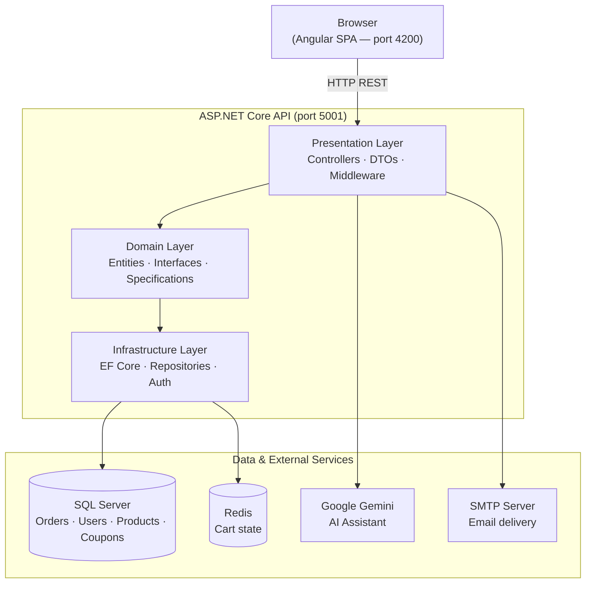
```mermaid
flowchart TD
    Browser["Browser\n(Angular SPA — port 4200)"]

    subgraph Backend ["ASP.NET Core API (port 5001)"]
        Presentation["Presentation Layer\nControllers · DTOs · Middleware"]
        Domain["Domain Layer\nEntities · Interfaces · Specifications"]
        Infrastructure["Infrastructure Layer\nEF Core · Repositories · Auth"]
    end

    subgraph Data ["Data & External Services"]
        SQL[("SQL Server\nOrders · Users · Products · Coupons")]
        Redis[("Redis\nCart state")]
        Gemini["Google Gemini\nAI Assistant"]
        SMTP["SMTP Server\nEmail delivery"]
    end

    Browser -->|"HTTP REST"| Presentation
    Presentation --> Domain
    Domain --> Infrastructure
    Infrastructure --> SQL
    Infrastructure --> Redis
    Presentation --> Gemini
    Presentation --> SMTP
```

---

## 6. Component Diagram

Detailed breakdown of frontend modules, backend layers and infrastructure services.

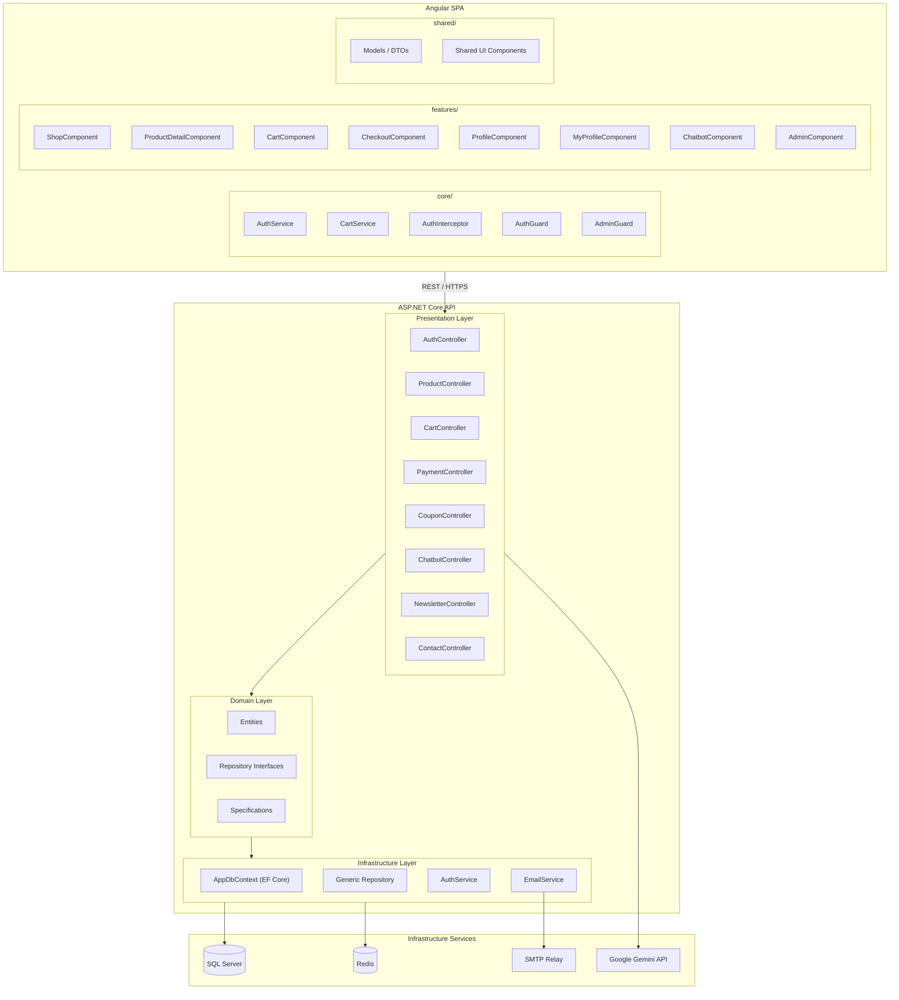
```mermaid
flowchart TB
    subgraph Frontend ["Angular SPA"]
        subgraph Core ["core/"]
            AuthService["AuthService"]
            CartService["CartService"]
            AuthInterceptor["AuthInterceptor"]
            AuthGuard["AuthGuard"]
            AdminGuard["AdminGuard"]
        end

        subgraph Features ["features/"]
            ShopComponent["ShopComponent"]
            ProductDetailComponent["ProductDetailComponent"]
            CartComponent["CartComponent"]
            CheckoutComponent["CheckoutComponent"]
            ProfileComponent["ProfileComponent"]
            MyProfileComponent["MyProfileComponent"]
            ChatbotComponent["ChatbotComponent"]
            AdminComponent["AdminComponent"]
        end

        subgraph Shared ["shared/"]
            Models["Models / DTOs"]
            SharedComponents["Shared UI Components"]
        end
    end

    subgraph API ["ASP.NET Core API"]
        subgraph Controllers ["Presentation Layer"]
            AuthController["AuthController"]
            ProductController["ProductController"]
            CartController["CartController"]
            PaymentController["PaymentController"]
            CouponController["CouponController"]
            ChatbotController["ChatbotController"]
            NewsletterController["NewsletterController"]
            ContactController["ContactController"]
        end

        subgraph Domain ["Domain Layer"]
            Entities["Entities"]
            Interfaces["Repository Interfaces"]
            Specifications["Specifications"]
        end

        subgraph Infrastructure ["Infrastructure Layer"]
            AppDbContext["AppDbContext (EF Core)"]
            Repositories["Generic Repository"]
            AuthService_BE["AuthService"]
            EmailService["EmailService"]
        end
    end

    subgraph Infra ["Infrastructure Services"]
        SQLServer[("SQL Server")]
        RedisCache[("Redis")]
        GeminiAPI["Google Gemini API"]
        SMTPRelay["SMTP Relay"]
    end

    Frontend -->|"REST / HTTPS"| Controllers
    Controllers --> Domain
    Domain --> Infrastructure
    Infrastructure --> SQLServer
    Infrastructure --> RedisCache
    Controllers --> GeminiAPI
    EmailService --> SMTPRelay
```

---

## 7. Domain Class Diagram

Core domain entities and their relationships at the analysis level.

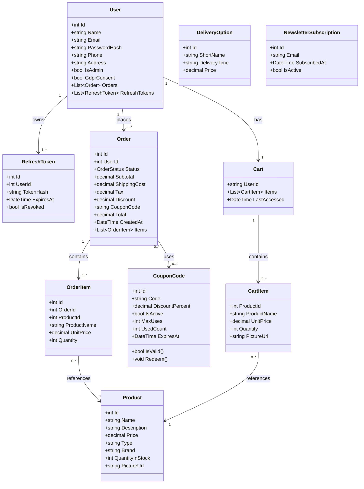
```mermaid
classDiagram
    class User {
        +int Id
        +string Name
        +string Email
        +string PasswordHash
        +string Phone
        +string Address
        +bool IsAdmin
        +bool GdprConsent
        +List~Order~ Orders
        +List~RefreshToken~ RefreshTokens
    }

    class RefreshToken {
        +int Id
        +int UserId
        +string TokenHash
        +DateTime ExpiresAt
        +bool IsRevoked
    }

    class Product {
        +int Id
        +string Name
        +string Description
        +decimal Price
        +string Type
        +string Brand
        +int QuantityInStock
        +string PictureUrl
    }

    class Order {
        +int Id
        +int UserId
        +OrderStatus Status
        +decimal Subtotal
        +decimal ShippingCost
        +decimal Tax
        +decimal Discount
        +string CouponCode
        +decimal Total
        +DateTime CreatedAt
        +List~OrderItem~ Items
    }

    class OrderItem {
        +int Id
        +int OrderId
        +int ProductId
        +string ProductName
        +decimal UnitPrice
        +int Quantity
    }

    class CouponCode {
        +int Id
        +string Code
        +decimal DiscountPercent
        +bool IsActive
        +int MaxUses
        +int UsedCount
        +DateTime ExpiresAt
        +bool IsValid()
        +void Redeem()
    }

    class DeliveryOption {
        +int Id
        +string ShortName
        +string DeliveryTime
        +decimal Price
    }

    class Cart {
        +string UserId
        +List~CartItem~ Items
        +DateTime LastAccessed
    }

    class CartItem {
        +int ProductId
        +string ProductName
        +decimal UnitPrice
        +int Quantity
        +string PictureUrl
    }

    class NewsletterSubscription {
        +int Id
        +string Email
        +DateTime SubscribedAt
        +bool IsActive
    }

    User "1" --> "1..*" Order : places
    User "1" --> "1..*" RefreshToken : owns
    User "1" --> "1" Cart : has
    Order "1" --> "1..*" OrderItem : contains
    Order "0..*" --> "0..1" CouponCode : uses
    OrderItem "0..*" --> "1" Product : references
    Cart "1" --> "0..*" CartItem : contains
    CartItem "0..*" --> "1" Product : references
```

> **Note:** `Cart` and `CartItem` live exclusively in Redis and are not persisted in SQL Server.

---

## 8. Data Model

Relational schema for SQL Server entities.

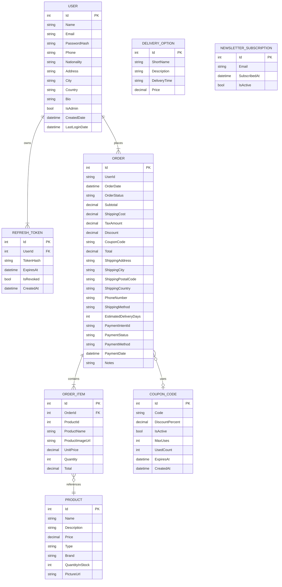
```mermaid
erDiagram
    USER {
        int Id PK
        string Name
        string Email
        string PasswordHash
        string Phone
        string Nationality
        string Address
        string City
        string Country
        string Bio
        bool IsAdmin
        datetime CreatedDate
        datetime LastLoginDate
    }

    REFRESH_TOKEN {
        int Id PK
        int UserId FK
        string TokenHash
        datetime ExpiresAt
        bool IsRevoked
        datetime CreatedAt
    }

    PRODUCT {
        int Id PK
        string Name
        string Description
        decimal Price
        string Type
        string Brand
        int QuantityInStock
        string PictureUrl
    }

    ORDER {
        int Id PK
        string UserId
        datetime OrderDate
        string OrderStatus
        decimal Subtotal
        decimal ShippingCost
        decimal TaxAmount
        decimal Discount
        string CouponCode
        decimal Total
        string ShippingAddress
        string ShippingCity
        string ShippingPostalCode
        string ShippingCountry
        string PhoneNumber
        string ShippingMethod
        int EstimatedDeliveryDays
        string PaymentIntentId
        string PaymentStatus
        string PaymentMethod
        datetime PaymentDate
        string Notes
    }

    ORDER_ITEM {
        int Id PK
        int OrderId FK
        int ProductId
        string ProductName
        string ProductImageUrl
        decimal UnitPrice
        int Quantity
        decimal Total
    }

    COUPON_CODE {
        int Id PK
        string Code
        decimal DiscountPercent
        bool IsActive
        int MaxUses
        int UsedCount
        datetime ExpiresAt
        datetime CreatedAt
    }

    DELIVERY_OPTION {
        int Id PK
        string ShortName
        string Description
        string DeliveryTime
        decimal Price
    }

    NEWSLETTER_SUBSCRIPTION {
        int Id PK
        string Email
        datetime SubscribedAt
        bool IsActive
    }

    USER ||--|{ ORDER : "places"
    USER ||--|{ REFRESH_TOKEN : "owns"
    ORDER ||--|{ ORDER_ITEM : "contains"
    ORDER_ITEM }o--|| PRODUCT : "references"
    ORDER }o--o| COUPON_CODE : "uses"
```

> **Note:** `Cart` is not persisted in SQL Server. It lives exclusively in Redis, keyed by `userId`, and expires after 10 minutes of inactivity.

---

## 9. Sequence Diagrams

### 9.1 Register Account

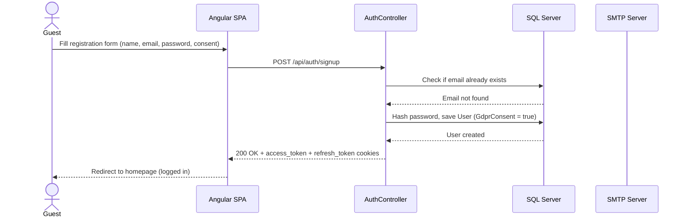
```mermaid
sequenceDiagram
    actor Guest
    participant Angular as Angular SPA
    participant API as AuthController
    participant DB as SQL Server
    participant SMTP as SMTP Server

    Guest->>Angular: Fill registration form (name, email, password, consent)
    Angular->>API: POST /api/auth/signup
    API->>DB: Check if email already exists
    DB-->>API: Email not found
    API->>DB: Hash password, save User (GdprConsent = true)
    DB-->>API: User created
    API-->>Angular: 200 OK + access_token + refresh_token cookies
    Angular-->>Guest: Redirect to homepage (logged in)
```

### 9.2 Login

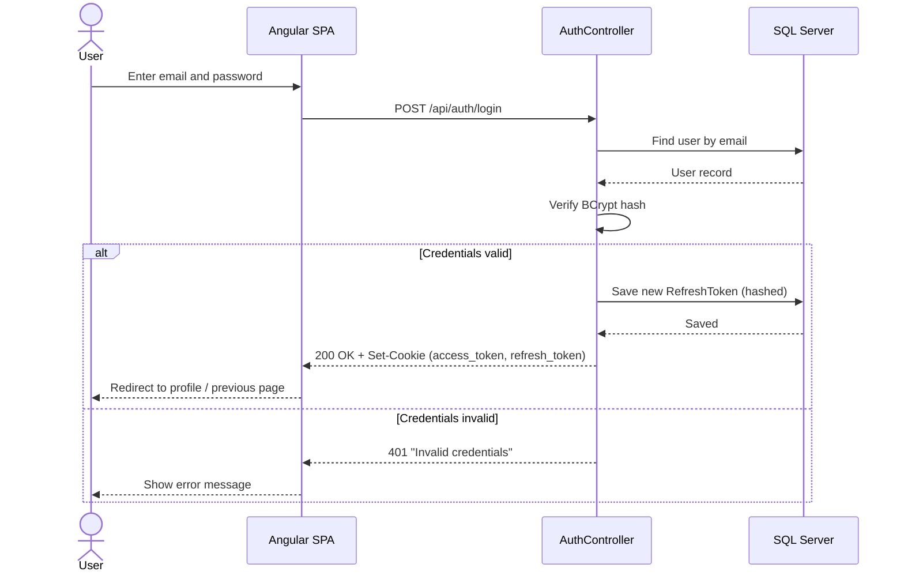
```mermaid
sequenceDiagram
    actor User
    participant Angular as Angular SPA
    participant API as AuthController
    participant DB as SQL Server

    User->>Angular: Enter email and password
    Angular->>API: POST /api/auth/login
    API->>DB: Find user by email
    DB-->>API: User record
    API->>API: Verify BCrypt hash
    alt Credentials valid
        API->>DB: Save new RefreshToken (hashed)
        DB-->>API: Saved
        API-->>Angular: 200 OK + Set-Cookie (access_token, refresh_token)
        Angular-->>User: Redirect to profile / previous page
    else Credentials invalid
        API-->>Angular: 401 "Invalid credentials"
        Angular-->>User: Show error message
    end
```

### 9.3 Add Product to Cart

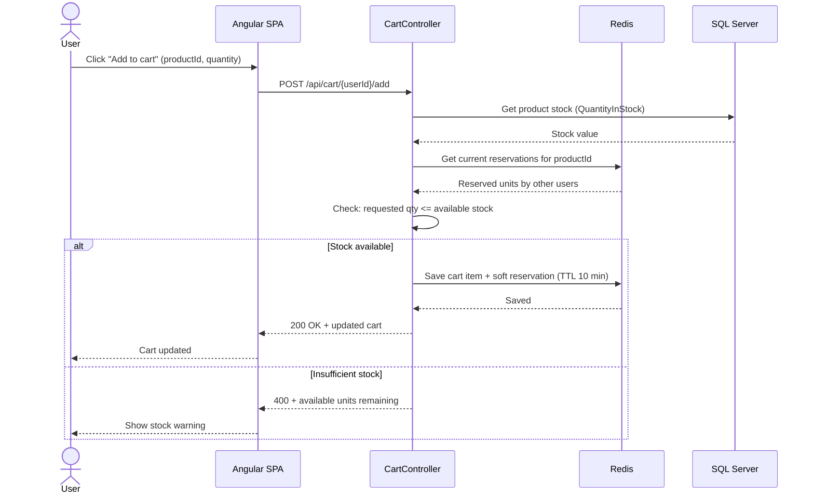
```mermaid
sequenceDiagram
    actor User
    participant Angular as Angular SPA
    participant API as CartController
    participant Redis as Redis
    participant DB as SQL Server

    User->>Angular: Click "Add to cart" (productId, quantity)
    Angular->>API: POST /api/cart/{userId}/add
    API->>DB: Get product stock (QuantityInStock)
    DB-->>API: Stock value
    API->>Redis: Get current reservations for productId
    Redis-->>API: Reserved units by other users
    API->>API: Check: requested qty <= available stock
    alt Stock available
        API->>Redis: Save cart item + soft reservation (TTL 10 min)
        Redis-->>API: Saved
        API-->>Angular: 200 OK + updated cart
        Angular-->>User: Cart updated
    else Insufficient stock
        API-->>Angular: 400 + available units remaining
        Angular-->>User: Show stock warning
    end
```

### 9.4 Checkout and Order Confirmation

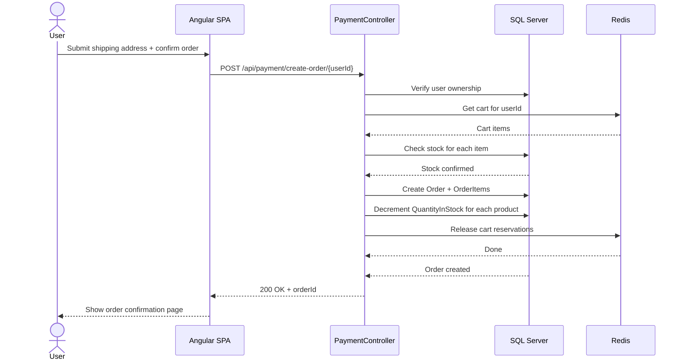
```mermaid
sequenceDiagram
    actor User
    participant Angular as Angular SPA
    participant PayAPI as PaymentController
    participant DB as SQL Server
    participant Redis as Redis

    User->>Angular: Submit shipping address + confirm order
    Angular->>PayAPI: POST /api/payment/create-order/{userId}
    PayAPI->>DB: Verify user ownership
    PayAPI->>Redis: Get cart for userId
    Redis-->>PayAPI: Cart items
    PayAPI->>DB: Check stock for each item
    DB-->>PayAPI: Stock confirmed
    PayAPI->>DB: Create Order + OrderItems
    PayAPI->>DB: Decrement QuantityInStock for each product
    PayAPI->>Redis: Release cart reservations
    Redis-->>PayAPI: Done
    DB-->>PayAPI: Order created
    PayAPI-->>Angular: 200 OK + orderId
    Angular-->>User: Show order confirmation page
```

### 9.5 Coupon Validation

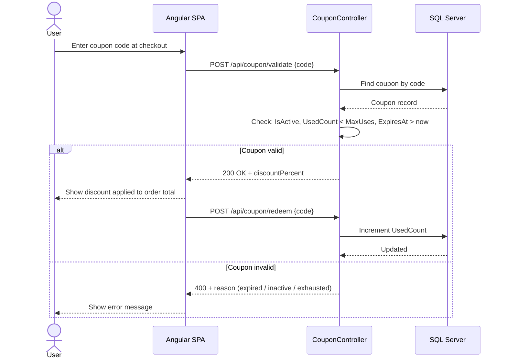
```mermaid
sequenceDiagram
    actor User
    participant Angular as Angular SPA
    participant API as CouponController
    participant DB as SQL Server

    User->>Angular: Enter coupon code at checkout
    Angular->>API: POST /api/coupon/validate {code}
    API->>DB: Find coupon by code
    DB-->>API: Coupon record
    API->>API: Check: IsActive, UsedCount < MaxUses, ExpiresAt > now
    alt Coupon valid
        API-->>Angular: 200 OK + discountPercent
        Angular-->>User: Show discount applied to order total
        Angular->>API: POST /api/coupon/redeem {code}
        API->>DB: Increment UsedCount
        DB-->>API: Updated
    else Coupon invalid
        API-->>Angular: 400 + reason (expired / inactive / exhausted)
        Angular-->>User: Show error message
    end
```

### 9.6 AI Assistant Message

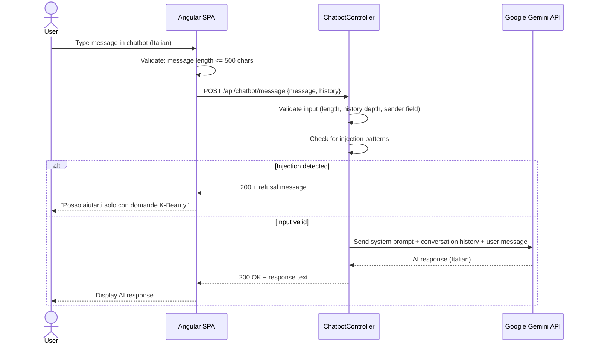
```mermaid
sequenceDiagram
    actor User
    participant Angular as Angular SPA
    participant API as ChatbotController
    participant Gemini as Google Gemini API

    User->>Angular: Type message in chatbot (Italian)
    Angular->>Angular: Validate: message length <= 500 chars
    Angular->>API: POST /api/chatbot/message {message, history}
    API->>API: Validate input (length, history depth, sender field)
    API->>API: Check for injection patterns
    alt Injection detected
        API-->>Angular: 200 + refusal message
        Angular-->>User: "Posso aiutarti solo con domande K-Beauty"
    else Input valid
        API->>Gemini: Send system prompt + conversation history + user message
        Gemini-->>API: AI response (Italian)
        API-->>Angular: 200 OK + response text
        Angular-->>User: Display AI response
    end
```

### 9.7 Newsletter Subscription

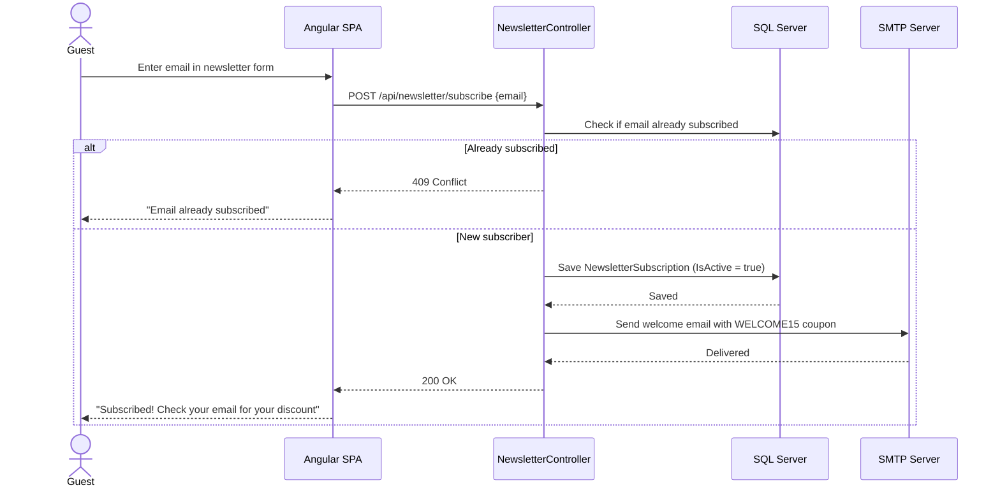
```mermaid
sequenceDiagram
    actor Guest
    participant Angular as Angular SPA
    participant API as NewsletterController
    participant DB as SQL Server
    participant SMTP as SMTP Server

    Guest->>Angular: Enter email in newsletter form
    Angular->>API: POST /api/newsletter/subscribe {email}
    API->>DB: Check if email already subscribed
    alt Already subscribed
        API-->>Angular: 409 Conflict
        Angular-->>Guest: "Email already subscribed"
    else New subscriber
        API->>DB: Save NewsletterSubscription (IsActive = true)
        DB-->>API: Saved
        API->>SMTP: Send welcome email with WELCOME15 coupon
        SMTP-->>API: Delivered
        API-->>Angular: 200 OK
        Angular-->>Guest: "Subscribed! Check your email for your discount"
    end
```

---

## 10. Activity Diagrams

### 10.1 Register Account

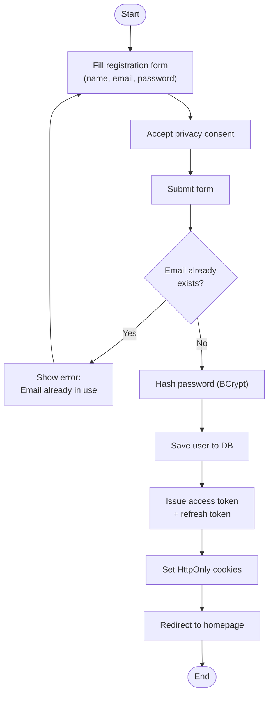
```mermaid
flowchart TD
    Start([Start]) --> FillForm["Fill registration form\n(name, email, password)"]
    FillForm --> AcceptConsent["Accept privacy consent"]
    AcceptConsent --> Submit["Submit form"]
    Submit --> CheckEmail{Email already\nexists?}
    CheckEmail -->|Yes| ShowError["Show error:\nEmail already in use"]
    ShowError --> FillForm
    CheckEmail -->|No| HashPassword["Hash password (BCrypt)"]
    HashPassword --> SaveUser["Save user to DB"]
    SaveUser --> IssueTokens["Issue access token\n+ refresh token"]
    IssueTokens --> SetCookies["Set HttpOnly cookies"]
    SetCookies --> Redirect["Redirect to homepage"]
    Redirect --> End([End])
```

### 10.2 Login

```mermaid
flowchart TD
    Start([Start]) --> EnterCredentials["Enter email and password"]
    EnterCredentials --> Submit["Submit login form"]
    Submit --> FindUser{User found\nby email?}
    FindUser -->|No| ShowError["Show error:\nInvalid credentials"]
    ShowError --> EnterCredentials
    FindUser -->|Yes| VerifyHash{Password\nhash valid?}
    VerifyHash -->|No| ShowError
    VerifyHash -->|Yes| SaveRefreshToken["Save refresh token\n(hashed) to DB"]
    SaveRefreshToken --> SetCookies["Set HttpOnly cookies\n(access + refresh token)"]
    SetCookies --> Redirect["Redirect to\nprevious page / profile"]
    Redirect --> End([End])
```

### 10.3 Add Product to Cart

```mermaid
flowchart TD
    Start([Start]) --> ClickAdd["User clicks Add to Cart"]
    ClickAdd --> SendRequest["POST /api/cart/{userId}/add"]
    SendRequest --> GetStock["Fetch product stock from DB"]
    GetStock --> GetReservations["Fetch active reservations\nfrom Redis"]
    GetReservations --> CalcAvailable["Calculate available =\nstock − reserved by others"]
    CalcAvailable --> CheckQty{Requested qty\n<= available?}
    CheckQty -->|No| ReturnError["Return 400 +\navailable units"]
    ReturnError --> ShowWarning["Show stock warning to user"]
    ShowWarning --> End([End])
    CheckQty -->|Yes| CheckCap{Total in cart\n> 99?}
    CheckCap -->|Yes| ReturnCap["Return 400 +\nmax quantity error"]
    ReturnCap --> ShowWarning
    CheckCap -->|No| SaveReservation["Save cart item + soft\nreservation in Redis (TTL 10 min)"]
    SaveReservation --> UpdateUI["Update cart UI"]
    UpdateUI --> End
```

### 10.4 Checkout and Order Confirmation

```mermaid
flowchart TD
    Start([Start]) --> AuthCheck{User\nauthenticated?}
    AuthCheck -->|No| RedirectLogin["Redirect to login"]
    RedirectLogin --> End([End])
    AuthCheck -->|Yes| EnterAddress["Enter shipping address"]
    EnterAddress --> SelectDelivery["Select delivery option"]
    SelectDelivery --> ApplyCoupon["Apply coupon (optional)"]
    ApplyCoupon --> ReviewOrder["Review order summary"]
    ReviewOrder --> ConfirmOrder["Confirm order"]
    ConfirmOrder --> VerifyStock{Stock still\navailable?}
    VerifyStock -->|No| ShowStockError["Show stock error"]
    ShowStockError --> ReviewOrder
    VerifyStock -->|Yes| CreateOrder["Create Order + OrderItems in DB"]
    CreateOrder --> DecrementStock["Decrement QuantityInStock"]
    DecrementStock --> ReleaseReservations["Release Redis reservations"]
    ReleaseReservations --> ShowConfirmation["Show order confirmation page"]
    ShowConfirmation --> End
```

### 10.5 Coupon Validation

```mermaid
flowchart TD
    Start([Start]) --> EnterCode["User enters coupon code"]
    EnterCode --> SendValidation["POST /api/coupon/validate"]
    SendValidation --> FindCoupon{Coupon\nfound?}
    FindCoupon -->|No| ShowError["Show error: Invalid code"]
    ShowError --> End([End])
    FindCoupon -->|Yes| CheckActive{IsActive\n= true?}
    CheckActive -->|No| ShowInactive["Show error: Coupon inactive"]
    ShowInactive --> End
    CheckActive -->|Yes| CheckExpiry{ExpiresAt\n> now?}
    CheckExpiry -->|No| ShowExpired["Show error: Coupon expired"]
    ShowExpired --> End
    CheckExpiry -->|Yes| CheckUses{UsedCount\n< MaxUses?}
    CheckUses -->|No| ShowExhausted["Show error: Coupon exhausted"]
    ShowExhausted --> End
    CheckUses -->|Yes| ApplyDiscount["Apply discount to order total"]
    ApplyDiscount --> IncrementUsage["POST /api/coupon/redeem\n(increment UsedCount)"]
    IncrementUsage --> ShowDiscount["Show discounted total to user"]
    ShowDiscount --> End
```

---

## 11. Order State Machine

```mermaid
stateDiagram-v2
    [*] --> Pending : Order created at checkout

    Pending --> Processing : Payment initiated
    Pending --> Cancelled : User cancels before processing

    Processing --> Confirmed : Payment simulation successful
    Processing --> Failed : Payment simulation failed

    Failed --> Pending : User retries

    Confirmed --> Shipped : Admin marks as shipped
    Confirmed --> Cancelled : Admin cancels confirmed order

    Shipped --> Delivered : Delivery confirmed

    Delivered --> [*]
    Cancelled --> [*]
```

---

## 12. Related Documents

| Document | Description |
|---|---|
| [`business_case.md`](./business_case.md) | Market opportunity and investment rationale |
| [`project_charter.md`](./project_charter.md) | Project objectives, scope and constraints |
| [`software_requirements_specification.md`](./software_requirements_specification.md) | Functional and non-functional requirements, user stories |
| [`api_specification.md`](./api_specification.md) | Full REST API reference |
| [`security.md`](./security.md) | Security model and compliance notes |