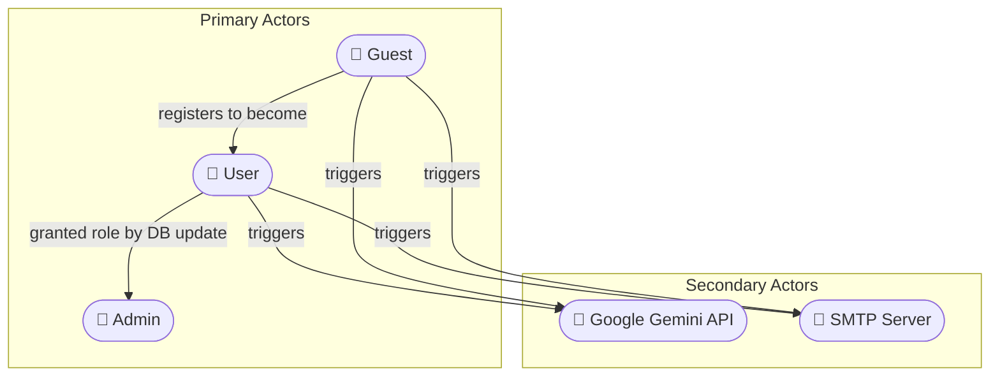
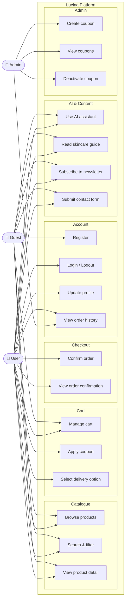
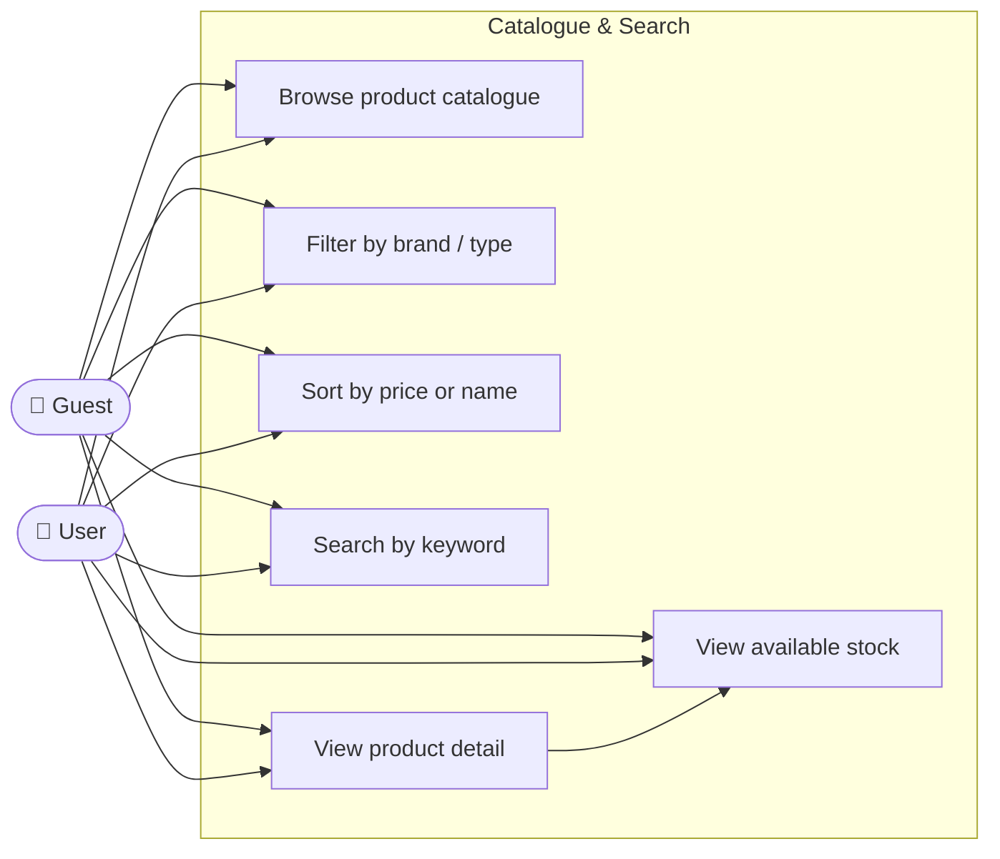
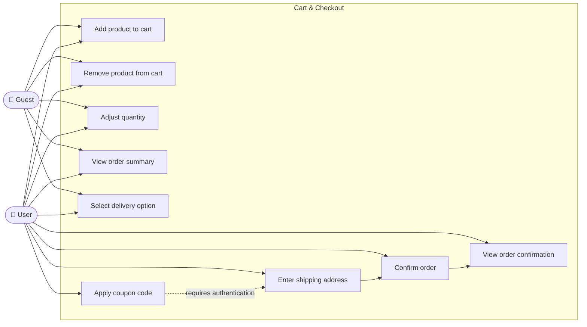
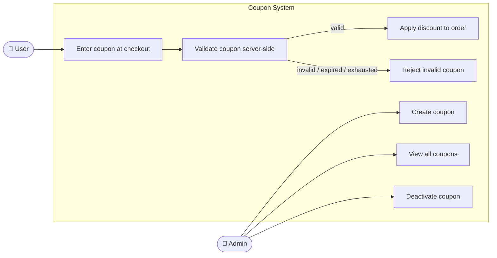
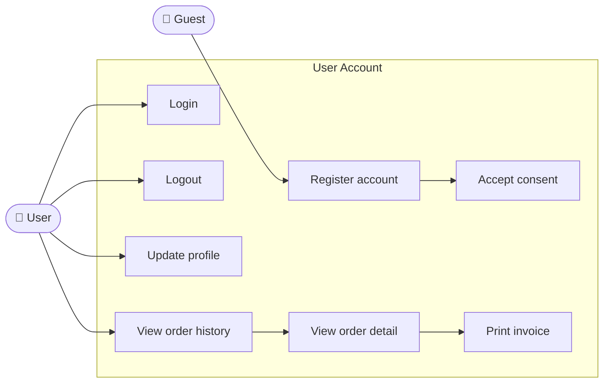
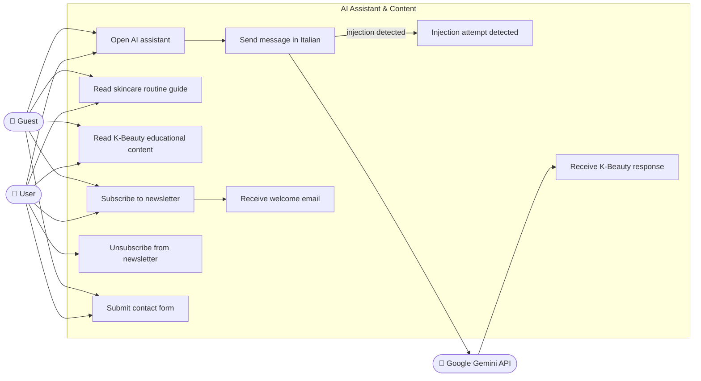

# Software Requirements Specification

## Table of Contents

1. [Introduction](#1-introduction)
2. [Overall Description](#2-overall-description)
3. [Functional Requirements](#3-functional-requirements)
4. [Non-Functional Requirements](#4-non-functional-requirements)
5. [User Stories](#5-user-stories)
6. [Requirements Traceability Matrix](#6-requirements-traceability-matrix)

---

## 1. Introduction

### 1.1 Purpose

This Software Requirements Specification (SRS) defines the functional and non-functional requirements for Lucina, a full-stack e-commerce platform for Korean skincare products targeting the Italian market. It serves as the authoritative reference for design, development and validation activities.

### 1.2 Scope

Lucina is a web-based e-commerce application. It provides end-to-end shopping functionality, from product discovery to order confirmation, together with an AI-powered K-Beauty assistant, a promotional coupon system, user account management and an administrative back-office.

Payment processing, physical logistics and a native mobile application are explicitly out of scope for version 1.0. See [`project_charter.md`](./project_charter.md) for the full scope definition.

### 1.3 Definitions and Acronyms

| Term | Definition |
|---|---|
| **Guest** | Unauthenticated user browsing the platform |
| **User** | Authenticated customer with a registered account |
| **Admin** | Authenticated user with elevated privileges for back-office operations |
| **Cart** | A temporary collection of products a user intends to purchase |
| **Coupon** | A promotional code that applies a percentage discount at checkout |
| **Order** | A confirmed purchase record associated with a user account |
| **SRS** | Software Requirements Specification |
| **FR** | Functional Requirement |
| **NFR** | Non-Functional Requirement |
| **COTS** | Commercial Off-The-Shelf |

### 1.4 References

| Document | Description |
|---|---|
| [`business_case.md`](./business_case.md) | Market context and investment rationale |
| [`project_charter.md`](./project_charter.md) | Project objectives, scope and constraints |
| [`software_design_document.md`](./software_design_document.md) | Architecture and design decisions |
| IEEE 830-1998 | IEEE Recommended Practice for Software Requirements Specifications |

### 1.5 Overview

Section 2 describes the product context and user classes. Section 3 lists all functional requirements grouped by subsystem. Section 4 defines non-functional requirements. Section 5 presents user stories. Section 6 provides the traceability matrix linking stories to requirements.

---

## 2. Overall Description

### 2.1 Product Perspective

Lucina is a standalone web application composed of an Angular single-page application (SPA) communicating with an ASP.NET Core REST API. The API integrates with SQL Server for persistent data, Redis for cart state, an external SMTP server for email delivery and the Google Gemini API for the AI assistant.

### 2.2 Product Functions

At a high level, Lucina provides:

- Product catalogue browsing, search and filtering
- Shopping cart management with inventory reservation
- Simulated checkout and order confirmation
- User account creation, authentication and profile management
- Promotional coupon creation, validation and redemption
- AI-powered K-Beauty assistant in Italian
- Newsletter subscription with automated welcome email
- Contact form with server-side email delivery
- Administrative back-office for coupon and order management

### 2.3 User Classes

| Class | Description | Interaction Level |
|---|---|---|
| **Guest** | Unauthenticated visitor; can browse, search and use the AI assistant | Low privilege |
| **User** | Registered customer; can manage cart, place orders and view order history | Standard privilege |
| **Admin** | Platform operator; can manage coupons and view all orders | Elevated privilege |

The following diagram shows how actors relate to one another and to the external services the system depends on.

### 2.4 Operating Environment

- **Client:** Any modern web browser (Chrome, Firefox, Safari, Edge) on desktop or mobile
- **Server:** ASP.NET Core 9 on Linux or Windows; requires .NET 9 runtime
- **Database:** SQL Server 2022
- **Cache:** Redis 7
- **Containerisation:** Docker Compose for local infrastructure

### 2.5 Constraints

- Real payment processing is not implemented in v1.0; checkout flow is simulated.
- Email delivery in development is intercepted by smtp4dev; a real SMTP provider is required for production.
- The AI assistant is dependent on Google Gemini API availability and quota.
- The platform is Italian-language only in v1.0.

### 2.6 Assumptions and Dependencies

- Users have access to a modern browser with JavaScript enabled.
- Admin users are created manually via a direct database update (no self-registration for Admin role).
- All monetary values are in EUR.

---

## 3. Functional Requirements

Requirements are assigned a priority using the MoSCoW method:
**M** = Must Have · **S** = Should Have · **C** = Could Have · **W** = Won't Have (v1.0)

The following diagram provides a high-level overview of which actors interact with which subsystems.

### 3.1 Product Catalogue

| ID | Requirement | Priority |
|---|---|---|
| FR-01 | The system shall display a paginated list of products with name, image, price and category | M |
| FR-02 | The system shall allow filtering products by brand and type | M |
| FR-03 | The system shall allow sorting products by price (ascending/descending) and name | M |
| FR-04 | The system shall provide a text search across product names and descriptions | M |
| FR-05 | The system shall display a product detail page with full description, price, brand, type and available stock | M |
| FR-06 | The system shall display skeleton loading placeholders while product data is fetching | S |

### 3.2 Shopping Cart

| ID | Requirement | Priority |
|---|---|---|
| FR-07 | The system shall allow any user (guest or authenticated) to add products to a cart | M |
| FR-08 | The system shall persist cart state across browser sessions using a server-side store | M |
| FR-09 | The system shall prevent adding a quantity that exceeds available stock | M |
| FR-10 | The system shall enforce a maximum quantity of 99 units per product per cart | M |
| FR-11 | The system shall allow users to remove individual items from the cart | M |
| FR-12 | The system shall display a running order summary including subtotal, shipping cost and total | M |
| FR-13 | The system shall apply a free shipping threshold for orders at or above €65 on standard shipping | S |
| FR-14 | The system shall allow users to select a delivery option with associated cost and estimated time | M |

### 3.3 Coupon System

| ID | Requirement | Priority |
|---|---|---|
| FR-15 | The system shall allow Users to enter a coupon code at checkout | M |
| FR-16 | The system shall validate the coupon server-side and return the applicable discount percentage | M |
| FR-17 | The system shall reject expired, inactive or exhausted coupons with an explanatory message | M |
| FR-18 | The system shall increment the usage counter of a coupon upon successful redemption | M |
| FR-19 | Admins shall be able to create coupons with a code, discount percentage, max uses and expiry date | M |
| FR-20 | Admins shall be able to view a list of all coupons with their current status | M |
| FR-21 | Admins shall be able to deactivate a coupon | M |

### 3.4 Checkout and Orders

| ID | Requirement | Priority |
|---|---|---|
| FR-22 | The system shall require authentication before proceeding to checkout | M |
| FR-23 | The system shall collect a shipping address during checkout | M |
| FR-24 | The system shall create an order record upon checkout confirmation | M |
| FR-25 | The system shall display an order confirmation page with order summary after successful checkout | M |
| FR-26 | The system shall display a printable invoice for each order | S |
| FR-27 | Users shall be able to view their full order history with status and item details | M |

### 3.5 User Accounts

| ID | Requirement | Priority |
|---|---|---|
| FR-28 | The system shall allow Guests to register with name, email and password | M |
| FR-29 | The system shall require consent acceptance at registration | M |
| FR-30 | The system shall allow registered Users to log in with email and password | M |
| FR-31 | The system shall issue a short-lived access token and a longer-lived refresh token upon login | M |
| FR-32 | The system shall transparently refresh the access token when it expires | M |
| FR-33 | The system shall allow Users to update their profile information | M |
| FR-34 | The system shall allow Users to log out, revoking the refresh token | M |

### 3.6 AI K-Beauty Assistant

| ID | Requirement | Priority |
|---|---|---|
| FR-35 | The system shall provide a conversational AI assistant responding in Italian | M |
| FR-36 | The assistant shall be restricted to K-Beauty and Lucina product topics | M |
| FR-37 | The system shall reject messages exceeding 500 characters | M |
| FR-38 | The system shall limit conversation history to the last 20 messages per session | S |
| FR-39 | The assistant shall respond to detected prompt injection attempts with a refusal message | M |

### 3.7 Newsletter and Contact

| ID | Requirement | Priority |
|---|---|---|
| FR-40 | The system shall allow any visitor to subscribe to the newsletter with an email address | M |
| FR-41 | The system shall send a welcome email with a promotional coupon code upon subscription | M |
| FR-42 | The system shall allow subscribers to unsubscribe, setting their subscription to inactive | M |
| FR-43 | The system shall provide a contact form that delivers submitted messages via email | M |

### 3.8 Content Pages

| ID | Requirement | Priority |
|---|---|---|
| FR-44 | The system shall provide a skincare routine guide page | S |
| FR-45 | The system shall provide a K-Beauty educational content page | S |
| FR-46 | The system shall provide a publicly accessible Privacy Policy page | M |
| FR-47 | The system shall provide a publicly accessible Terms of Service page | M |
| FR-48 | The system shall provide an FAQ page | C |

---

## 4. Non-Functional Requirements

### 4.1 Performance

| ID | Requirement | Priority |
|---|---|---|
| NFR-01 | Product listing pages shall load within 3 seconds on a standard broadband connection | M |
| NFR-02 | API endpoints shall respond within 500ms under normal load | S |
| NFR-03 | The system shall support cart operations without perceptible delay for up to 50 concurrent users | S |

### 4.2 Security

| ID | Requirement | Priority |
|---|---|---|
| NFR-04 | All authentication tokens shall be stored in HttpOnly cookies, never in browser storage | M |
| NFR-05 | All API communication shall occur over HTTPS | M |
| NFR-06 | The system shall enforce role-based access control on all write and admin endpoints | M |
| NFR-07 | Cart and payment endpoints shall verify ownership before processing any operation | M |
| NFR-08 | The system shall set security response headers on every API response (X-Content-Type-Options, X-Frame-Options, X-XSS-Protection, Referrer-Policy) | M |
| NFR-09 | Production error responses shall not expose stack traces or internal implementation details | M |
| NFR-10 | Authentication failure messages shall not distinguish between unknown email and wrong password | M |

### 4.3 Usability

| ID | Requirement | Priority |
|---|---|---|
| NFR-11 | The UI shall be fully functional on mobile devices (mobile-first responsive design) | M |
| NFR-12 | The platform shall be presented entirely in Italian | M |
| NFR-13 | The system shall display loading indicators during all asynchronous operations | S |
| NFR-14 | Error messages shown to the user shall be written in plain Italian, without technical jargon | S |

### 4.4 Reliability

| ID | Requirement | Priority |
|---|---|---|
| NFR-15 | Cart state shall survive browser refresh and session interruption | M |
| NFR-16 | Soft inventory reservations shall expire automatically after 10 minutes of inactivity | M |
| NFR-17 | Stale inventory reservations shall be cleaned up lazily on the next stock availability check | S |

### 4.5 Maintainability

| ID | Requirement | Priority |
|---|---|---|
| NFR-18 | The backend shall follow a clean three-layer architecture (Presentation, Domain, Infrastructure) | M |
| NFR-19 | Data access shall use the Repository and Specification patterns | M |
| NFR-20 | All application secrets shall be loaded from environment variables, never hardcoded | M |

### 4.6 Compliance

| ID | Requirement | Priority |
|---|---|---|
| NFR-21 | The system shall collect explicit consent at user registration | M |
| NFR-22 | The system shall provide accessible Privacy Policy and Terms of Service pages | M |
| NFR-23 | Newsletter unsubscribe shall use soft deletion, preserving the subscription record | M |

---

## 5. User Stories

### 5.1 Guest

| ID | User Story | Linked FR |
|---|---|---|
| US-01 | As a Guest, I want to browse the product catalogue so that I can discover K-Beauty products available on Lucina | FR-01 |
| US-02 | As a Guest, I want to filter and sort products by brand, type and price so that I can quickly find what I am looking for | FR-02, FR-03 |
| US-03 | As a Guest, I want to search for products by keyword so that I can find specific items without browsing the full catalogue | FR-04 |
| US-04 | As a Guest, I want to view a product detail page so that I can read the full description and check availability before adding to cart | FR-05 |
| US-05 | As a Guest, I want to add products to my cart so that I can collect items before deciding to register and purchase | FR-07 |
| US-06 | As a Guest, I want to ask the AI assistant questions in Italian so that I can get personalised K-Beauty guidance without speaking to a human | FR-35, FR-36 |
| US-07 | As a Guest, I want to subscribe to the newsletter so that I can receive a welcome discount and stay updated on promotions | FR-40, FR-41 |
| US-08 | As a Guest, I want to submit a contact form so that I can reach the Lucina team with questions or feedback | FR-43 |
| US-09 | As a Guest, I want to register an account so that I can save my orders and access checkout | FR-28, FR-29 |

### 5.2 User

| ID | User Story | Linked FR |
|---|---|---|
| US-10 | As a User, I want to log in with my email and password so that I can access my account and cart | FR-30, FR-31 |
| US-11 | As a User, I want my session to remain active without re-logging in so that I can browse without interruption | FR-32 |
| US-12 | As a User, I want to update my profile information so that my account details remain accurate | FR-33 |
| US-13 | As a User, I want to manage my cart — add, remove and adjust quantities — so that I can control exactly what I am ordering | FR-07, FR-09, FR-10, FR-11 |
| US-14 | As a User, I want to see the order total update in real time as I change my cart so that I always know what I will pay | FR-12, FR-13, FR-14 |
| US-15 | As a User, I want to apply a coupon code at checkout so that I can benefit from available promotions | FR-15, FR-16, FR-17 |
| US-16 | As a User, I want to enter my shipping address and confirm my order so that I can complete my purchase | FR-22, FR-23, FR-24 |
| US-17 | As a User, I want to receive an order confirmation page after checkout so that I know my order was placed successfully | FR-25 |
| US-18 | As a User, I want to view my order history so that I can track past purchases and check their status | FR-27 |
| US-19 | As a User, I want to print an invoice for an order so that I can keep a record for personal or tax purposes | FR-26 |
| US-20 | As a User, I want to log out so that my session is terminated securely | FR-34 |
| US-21 | As a User, I want to unsubscribe from the newsletter so that I stop receiving promotional emails | FR-42 |

### 5.3 Admin

| ID | User Story | Linked FR |
|---|---|---|
| US-22 | As an Admin, I want to create a new coupon with a custom code, discount, usage limit and expiry so that I can run targeted promotions | FR-19 |
| US-23 | As an Admin, I want to view all coupons and their current usage so that I can monitor the effectiveness of promotions | FR-20 |
| US-24 | As an Admin, I want to deactivate a coupon so that I can stop a promotion before it expires | FR-21 |

---

## 6. Requirements Traceability Matrix

| User Story | Functional Requirements | Non-Functional Requirements |
|---|---|---|
| US-01 | FR-01 | NFR-01, NFR-11, NFR-12 |
| US-02 | FR-02, FR-03 | NFR-01, NFR-11 |
| US-03 | FR-04 | NFR-01, NFR-11 |
| US-04 | FR-05, FR-06 | NFR-01, NFR-13 |
| US-05 | FR-07, FR-09, FR-10 | NFR-15, NFR-16 |
| US-06 | FR-35, FR-36, FR-37, FR-38, FR-39 | NFR-12 |
| US-07 | FR-40, FR-41 | NFR-12 |
| US-08 | FR-43 | NFR-12 |
| US-09 | FR-28, FR-29 | NFR-06, NFR-21, NFR-22 |
| US-10 | FR-30, FR-31 | NFR-04, NFR-05, NFR-06 |
| US-11 | FR-32 | NFR-04, NFR-05 |
| US-12 | FR-33 | NFR-06 |
| US-13 | FR-07, FR-09, FR-10, FR-11 | NFR-15, NFR-16, NFR-17 |
| US-14 | FR-12, FR-13, FR-14 | NFR-11, NFR-13 |
| US-15 | FR-15, FR-16, FR-17, FR-18 | NFR-06, NFR-07 |
| US-16 | FR-22, FR-23, FR-24 | NFR-05, NFR-06, NFR-07 |
| US-17 | FR-25 | NFR-11, NFR-12 |
| US-18 | FR-27 | NFR-06, NFR-11 |
| US-19 | FR-26 | NFR-11 |
| US-20 | FR-34 | NFR-04 |
| US-21 | FR-42 | NFR-23 |
| US-22 | FR-19 | NFR-06 |
| US-23 | FR-20 | NFR-06 |
| US-24 | FR-21 | NFR-06 |